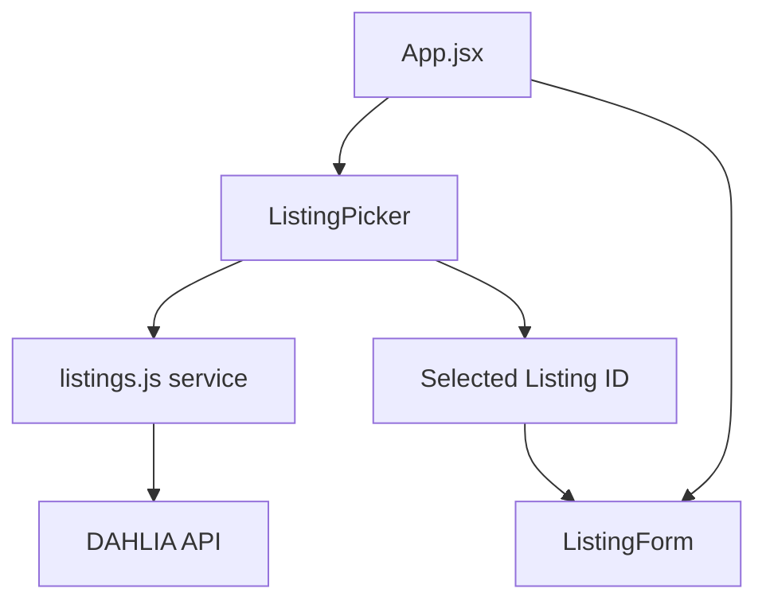

# Design Document: Listing Picker

## Overview

The listing picker feature adds a dropdown component to the application generator UI that fetches and displays available pre-lottery listings from the DAHLIA API. Users can select a listing from the dropdown or manually enter a listing ID. The component automatically refreshes when the server selection changes.

## Architecture

The feature follows the existing React component architecture with a new service function for fetching listings and a new component for the picker UI.



## Components and Interfaces

### ListingPicker Component

A new React component that handles listing selection.

**Props:**
```typescript
interface ListingPickerProps {
  server: string;                    // Current server selection ('full' | 'prod')
  selectedListingId: string;         // Currently selected listing ID
  onListingChange: (id: string) => void;  // Callback when listing changes
  disabled?: boolean;                // Disable during generation
}
```

**Internal State:**
- `listings`: Array of fetched listings
- `isLoading`: Boolean for loading state
- `error`: Error message if fetch fails
- `mode`: 'picker' | 'manual' for input mode

### Listing Service Functions

New functions in `src/services/listings.js`:

```typescript
interface Listing {
  Id: string;
  Name: string;
  Lottery_Status: string;
  Building_Name: string;
  Application_Due_Date: string;
}

function fetchListings(server: string): Promise<Listing[]>
function filterPreLotteryListings(listings: Listing[]): Listing[]
```

## Data Models

### Listing Object (from API)

Key fields used from the API response:
- `Id`: Unique identifier (e.g., "a0W7y00000ElWZ3EAN")
- `Name`: Display name (e.g., "2550 Irving")
- `Lottery_Status`: Status string, filter for "Not Yet Run"
- `Building_Name`: Building name for display
- `Application_Due_Date`: ISO date string for due date

### API Endpoints

| Server | Base URL | Endpoint |
|--------|----------|----------|
| Full | https://dahlia-full.herokuapp.com | /api/v1/listings.json?type=rental&subset=browse |
| Production | https://housing.sfgov.org | /api/v1/listings.json?type=rental&subset=browse |

## Correctness Properties

*A property is a characteristic or behavior that should hold true across all valid executions of a system-essentially, a formal statement about what the system should do. Properties serve as the bridge between human-readable specifications and machine-verifiable correctness guarantees.*

### Property 1: Pre-lottery filtering correctness
*For any* array of listings with various Lottery_Status values, the filterPreLotteryListings function SHALL return only listings where Lottery_Status equals "Not Yet Run"
**Validates: Requirements 1.2**

### Property 2: Listing display contains name
*For any* listing object with a Name field, when rendered in the dropdown, the rendered output SHALL contain the listing's Name value
**Validates: Requirements 1.3**

### Property 3: Selection sets correct ID
*For any* listing selected from the dropdown, the onListingChange callback SHALL be called with that listing's Id value
**Validates: Requirements 1.4**

### Property 4: Server change clears selection
*For any* server change event, the selected listing ID SHALL be cleared (set to empty string)
**Validates: Requirements 4.2**

### Property 5: Mode switch preserves value
*For any* sequence of mode switches between 'picker' and 'manual', if a value was previously set, switching back to that mode SHALL restore the previously set value
**Validates: Requirements 3.3**

## Error Handling

| Scenario | Behavior |
|----------|----------|
| API fetch fails | Display error message with retry button |
| No pre-lottery listings | Display "No listings available" message |
| Network timeout | Display error with retry option |
| Invalid server | Fall back to default server |

## Testing Strategy

### Unit Tests
- Test `filterPreLotteryListings` with various listing arrays
- Test component renders correctly in different states (loading, error, loaded)
- Test mode switching behavior

### Property-Based Tests

Using `fast-check` library for property-based testing:

1. **Filter correctness property**: Generate random arrays of listings with random Lottery_Status values, verify filter only returns "Not Yet Run" listings
2. **Selection ID property**: Generate random listings, simulate selection, verify correct ID is passed to callback
3. **Server change property**: Generate random server changes, verify selection is cleared
4. **Mode preservation property**: Generate random sequences of mode switches and values, verify preservation

### Integration Tests
- Test full flow from server selection to listing fetch to application generation
- Test error recovery with retry functionality
